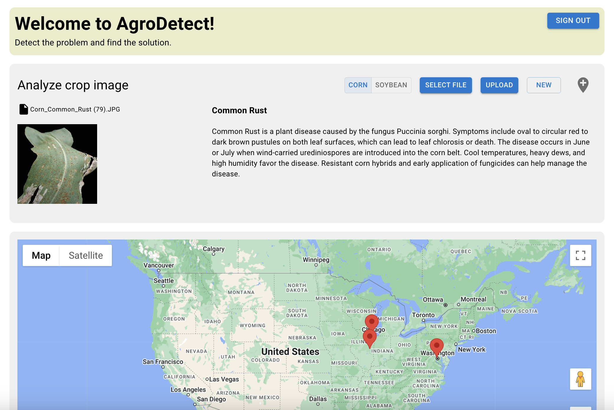

# AgroDetect-WebApp

This project was origonally built during HackIllinois 2023 - Origonal repository found [here](https://github.com/Ky-Lee-375/AgroDetect)

This deep copy was created specifically for refactoring the project to be suitable for aws deployment.

## 🚧 Plans to Refactor Project 🚧
Work is currently being done to apply distributed systems principles to make this app suitable to be scaled up in the future. This will involve redesigning the applications archetecture (e.g. backed services, databases, and more). All of these changes should fit within the aws free tier.

## Overview

This repository has two main subdirectories the each contain a part of the application

### agroApp

This subdirectory contains the code for the frontend application. In here, you will find the code that renders the views, files for AWS Amplify deployment, as well as the code for location sharing/tracking. This section was mainly built using React, JavaScript, and Material-UI.

### middleware

This subdirectory contains the code needed to classify the image retrieved in the application from the user. The prediction model was trained using tensorflow, and interacts with the frontend via HTTP requests to a Flask server. This section was built almost entirely from python

## Deployment

Currently, the app is deployed to https://main.d24kyd864elxsq.amplifyapp.com/, but does not yet support uploading an image to retrieve a prediction (work in progress). The full app functionalities are only available when run on your local machine.

## Installation

1. Clone this repository to your local machine
2. Change directory into `/agroApp`
3. Install the dependencies
4. Start the development server
5. Change directory into `/middleware`
6. Install the dependencies
7. Start the flask server
8. You should be able to interact with the app now!

## Contributors

> [Claudia Lee](https://github.com/Ky-Lee-375/)
>  
> [Joe Ku](https://github.com/joku8/)
